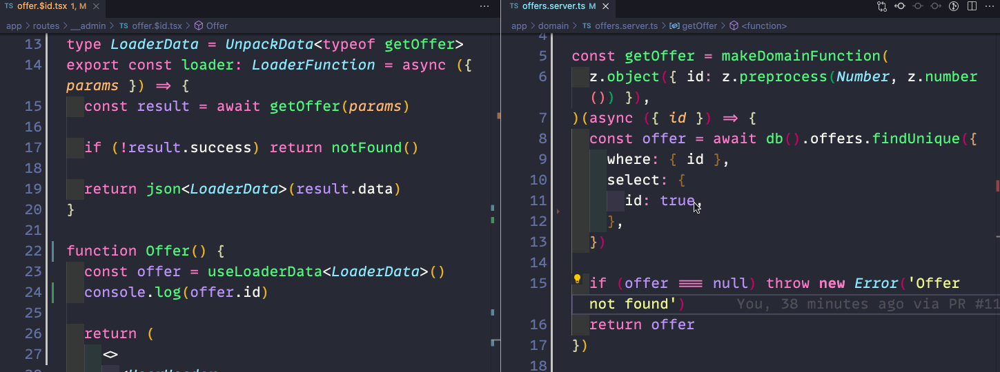

# Remix Domains

Remix Domains helps you to keep your Business Logic appart from your actions/loaders plumbing.
It does this by enforcing the parameters' types in runtime (through [zod](https://github.com/colinhacks/zod#what-is-zod) schemas) and always wrapping results (even exceptions) into a `Promise<Result<Output>>` type.



## Benefits
- End-to-End typesafety all the way from the Backend to the UI
- Keep your domain functions decoupled from the framework, with the assurance that your values conform to your types
- Easier to test and maintain business logic
- Business Logic can be expressed in the type system
- Removes the plumbing of extracting and parsing structured data from your actions

## Quickstart

```
npm i remix-domains zod
```

```tsx
import { makeDomainFunction, inputFromForm } from 'remix-domains'
import * as z from 'zod'

const schema = z.object({ number: z.preprocess(Number, z.number()) })
const increment = makeDomainFunction(schema)(async ({ number }) => number + 1)

const result = await increment({ number: 1 }) // result = { data: 2, success: true }
const failedResult = await increment({ number: 'foo' })
/*
failedResult = {
  success: false,
  inputErrors: [{ path: ['number'], message: 'Expected number, received nan' }]
}
*/
```

To understand how to build the schemas, refer to [Zod documentation](https://github.com/colinhacks/zod#defining-schemas).

## Create your first action with Remix
```tsx
import type { ActionFunction } from 'remix'
import { useActionData, redirect } from 'remix'
import { makeDomainFunction, inputFromForm } from 'remix-domains'
import * as z from 'zod'

const schema = z.object({ number: z.preprocess(Number, z.number()) })
const increment = makeDomainFunction(schema)(({ number }) => number + 1)

export const action: ActionFunction = async ({ request }) => {
  const result = await increment(await inputFromForm(request))

  if (!result.success) return result

  return redirect('/')
}

export default function Index() {
  const actionData = useActionData()

  return (
    <Form method="post">
      <input name="number" type="number" />
      {actionData.inputErrors && (
        <span role="alert">{actionData.inputErrors[0].message}</span>
      )}
      <button type="submit">
        Submit
      </button>
    </Form>
  )
}
```

## Taking parameters that are not user input

Sometimes you want to ensure the safety of certain values that weren't explicitly sent by the user. We call them environment:

```tsx
const sendEmail = makeDomainFunction(
  z.object({ email: z.string().email() }), // user input schema
  z.object({ origin: z.string() }) // environment schema
)(
  async ({ email }, { origin }) => {
    mailer.send({
      email,
      message: `Link to reset password: ${origin}/reset-password`
    })
  }
)

// In your Remix action:
export const action = async ({ request }) => {
  const environment = (request: Request) => ({
    origin: new URL(request.url).origin,
  })

  await sendResetToken(
    await inputFromForm(request),
    environment(request),
  )
}
```

We usually use the environment for ensuring authenticated requests.
In this case, assume you have a `currentUser` function that returns the authenticated user:
```tsx
const dangerousFunction = makeDomainFunction(
  someInputSchema,
  z.object({ user: z.object({ id: z.string(), admin: z.literal(true) }) })
)(async (input, { user }) => {
  // do something that only the admin can do
})
```

## Dealing with errors
The error result has the following structure:
```ts
type ErrorResult = {
  success: false
  errors: z.ZodIssue[] | { message: string }
  inputErrors: z.ZodIssue[]
}
```

Where `inputErrors` will be the errors from parsing the user input and `errors` will be either from parsing the environment or any exceptions thrown inside the domain function:

```ts
const alwaysFails = makeDomainFunction(input, environment)(async () => {
  throw new Error('Some error')
})

const failedResult = await alwaysFails(someInput)
/*
failedResult = {
  success: false,
  errors: [{ message: 'Some error' }],
  inputErrors: []
}
*/
```

## Type Utilities

### UnpackData
It infers the returned data of a successful domain function:
```ts
const fn = makeDomainFunction()(async () => '')

type LoaderData = UnpackData<typeof fn>
// LoaderData = string
```

## Input Utilities
We export some functions to help you extract values out of your requests before sending them as user input.

### inputFromForm

Extracts values sent in a request through the `FormData` as an object of values:
```tsx
// Given the following form:
function Form() {
  return (
    <form method="post">
      <input name="email" value="john@doe.com" />
      <input name="password" value="1234" />
      <button type="submit">
        Submit
      </button>
    </form>
  )
}

export const action = async ({ request }) => {
  const values = await inputFromForm(request)
  // values = { email: 'john@doe.com', password: '1234' }
}
```

### inputFromUrl
Extracts values sent in a request through the URL as an object of values:
```tsx
// Given the following form:
function Form() {
  return (
    <form method="get">
      <button name="page" value="2">
        Change URL
      </button>
    </form>
  )
}

export const action = async ({ request }) => {
  const values = inputFromUrl(request)
  // values = { page: '2' }
}
```

Both of these functions will parse the input using [`qs`](https://www.npmjs.com/package/qs):
```tsx
// Given the following form:
function Form() {
  return (
    <form method="post">
      <input name="numbers[]" value="1" />
      <input name="numbers[]" value="2" />
      <input name="person[0][email]" value="john@doe.com" />
      <input name="person[0][password]" value="1234" />
      <button type="submit">
        Submit
      </button>
    </form>
  )
}

export const action = async ({ request }) => {
  const values = await inputFromForm(request)
  /*
  values = {
    numbers: ['1', '2'],
    person: [{ email: 'john@doe.com', password: '1234' }]
  }
  */
}
```

To better understand how to structure your data, refer to [qs documentation](https://github.com/ljharb/qs#parsing-objects)
